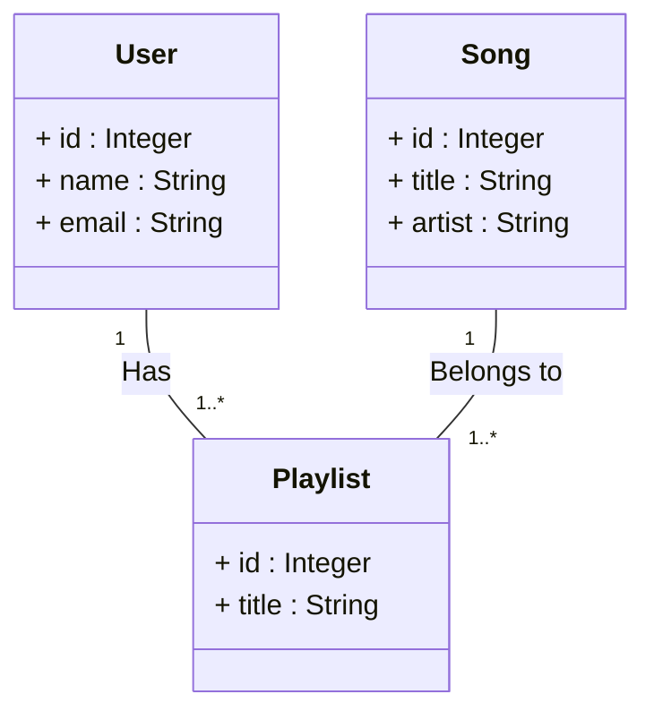

## Music-collections
# Diagrama de classe

```mermaid
classDiagram
  class User {
    + id : Integer
    + name : String
    + email : String
  }
  class Song {
    + id : Integer
    + title : String
    + artist : String
  }
  class Playlist {
    + id : Integer
    + title : String
  }
  
  User "1" -- "1..*" Playlist : Has
  Song "1" -- "1..*" Playlist : Belongs to
```
